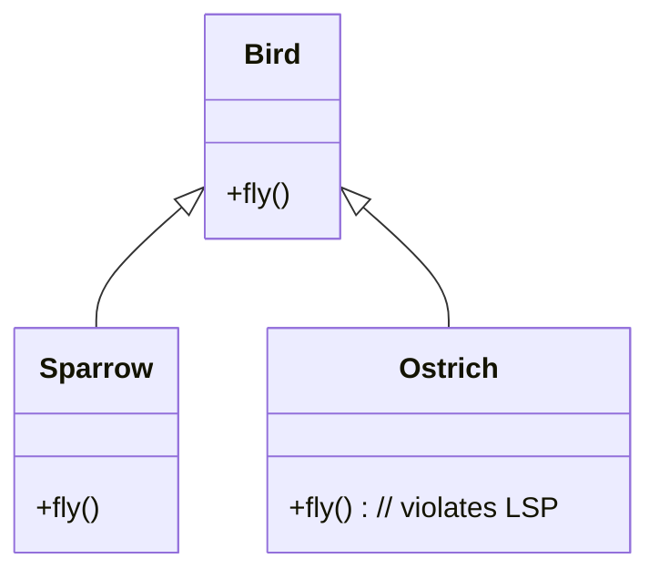

# Liskov Substitution Principle

Liskov's substitution principle (LSP) states that there is a series of properties that an object type must hold to preserve the reliability of its design.
The main idea behind LSP is that, for any class, a client should be able to use any of its subtypes indistinguishably, without even noticing, and therefore without compromising the expected behavior at runtime. That means that clients are completely isolated and unaware of changes in the class hierarchy.
More formally, this is the original definition (Liskov 1987
) of LSP: **if S is a subtype of T, then objects of type T may be replaced by objects of type S, without breaking the program.**



- Sparrow is a Bird and it can fly
- Ostrich is not a bird. 

This violate the LSP principle: Ostrich can't fly, so it shouldn't inherit Bird if fly() is expected to work — this violates LSP.

## Annotation and Liskov Substitution Principle

In modern Python, type annotations aren't just for editor hints — they're part of how we communicate and enforce design contracts in object-oriented code. A common pitfall arises when overriding methods in subclasses with incompatible parameter types. This often surfaces subtly and may even be silenced by # type: ignore, but doing so is a design mistake that can lead to real bugs.

Let’s walk through a concrete example and see how to fix it properly using standard Python tools.

### The Problem: Inconsistent Method Signatures

Suppose we have a base class Event and a subclass LoginEvent:

```python
class Event:
    def meets_condition(self, event_data: dict) -> bool:
        return False

class LoginEvent(Event):
    def meets_condition(self, event_data: list) -> bool:
        return bool(event_data)
```

At first glance, this may seem fine — both methods return a boolean and just differ in how they interpret the input. However, there’s a type mismatch in the overridden method: the base class accepts a dict, and the subclass expects a list.

This breaks a fundamental object-oriented design principle: Liskov Substitution Principle (LSP). If a function is written to accept an Event, it should also work correctly with a LoginEvent — but here, it would fail if event_data is a dict.

Let's check configure ruff 
```yaml
[tool.ruff]
line-length = 80
target-version = "py311"

# Enable rule sets that align with Google style
select = [
    "E",   # pycodestyle
    "F",   # pyflakes
    "I",   # isort (import sorting)
    "N",   # pep8-naming
    "B",    # flake8-bugbear (good for clean code)
    "D",   # pydocstyle (use with Google docstring convention)
    "UP",  # pyupgrade
]
```

And execute on that code 
```
$ ruff check .
```
#### The Wrong "Fix": Broadening the Union
One might try to "fix" this like so:
```python

class Event:
    def meets_condition(self, event_data: list | dict) -> bool:
        return False

class LoginEvent(Event):
    def meets_condition(self, event_data: list | dict) -> bool:
        return bool(event_data)
```

This shuts up the type checker, but it’s just masking the real problem. You're still forcing the method to be aware of two concrete data types (list, dict) instead of describing what the method actually needs — something it can iterate over and check for emptiness.

What if we want to support other iterable types like set, tuple, or even custom iterable classes? Should we keep adding to the union? Clearly not.

#### The Right Fix: Use Abstractions Like Iterable or Collection
The correct approach is to generalize the type to match the method's actual requirements. If we just want to check whether event_data has elements, the right abstraction is either:

- *Iterable* – if we only need to loop over items.
- *Collection* – if we need to check length, membership, etc.

Let’s update the code:

```python
from collections.abc import Collection

class Event:
    def meets_condition(self, event_data: Collection) -> bool:
        return False

class LoginEvent(Event):
    def meets_condition(self, event_data: Collection) -> bool:
        return bool(event_data)
```
Now:

- The method works with any collection type: list, dict, set, etc.
- The subclass properly overrides the base method without any type conflicts.
- The design is flexible, future-proof, and idiomatic.

#### Bonus: Clean, Extensible Design
By embracing abstract base classes from collections.abc, you make your code more expressive and robust. This opens the door to supporting a wide range of inputs while keeping your type hints correct.

Here’s how it might scale with another subclass:

```python

class ErrorEvent(Event):
    def meets_condition(self, event_data: Collection) -> bool:
        return "error" in event_data
```
No surprises. Everything works as expected — cleanly and correctly.

Note: *DO NOT ignore errors* such as this by using # type: ignore or something similar. Refactor or change the code to solve the real problem. The tools are reporting an actual design flaw for a valid reason. A better way to extend this is notice that both list and dict are Iterable.